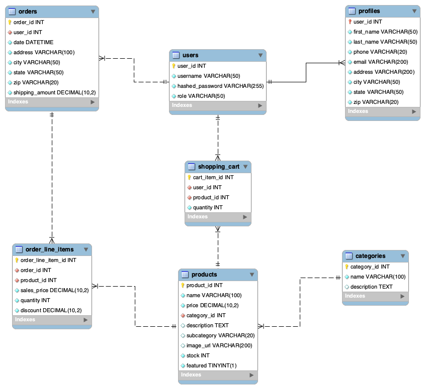
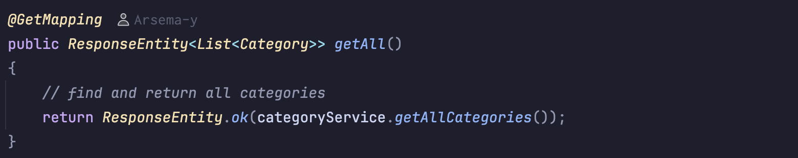
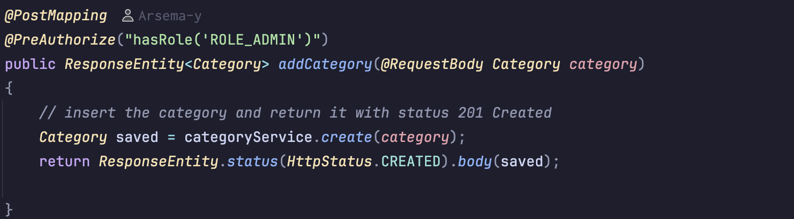
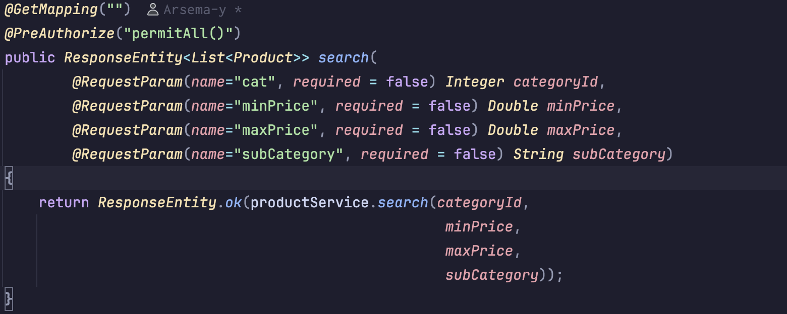
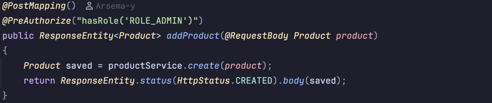
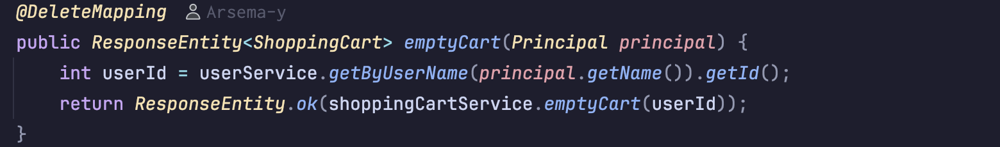
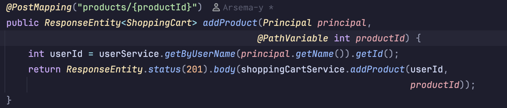
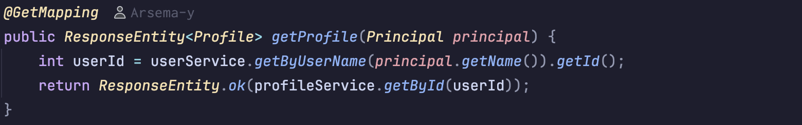
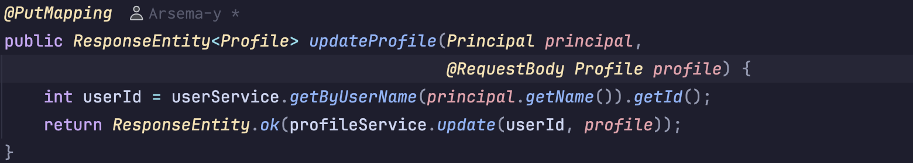

#  👔 ShowOff Clothing store 🛒
   ###     _E-Commerce API_

A (mostly) functional backend REST API for an online store, built with Spring Boot and MySQL. **Users** can browse products by category, manage a shopping cart, and update their profile. **Admins** can manage products and categories.

---

## 📖 Overview

This project is the backend API for an e-commerce web application. The frontend is a pre-built JavaScript web app that communicates with this API to power the full shopping experience — from browsing products to adding items to cart (checking out not yet built).

The API was built on top of existing starter code. The work involved:
- 🐛 Finding and fixing bugs in the product search and update logic
- 🏗️ Implementing the Categories feature from scratch
- 🛒 Building the Shopping Cart feature end to end
- 👤 Adding User Profile view and edit functionality

---

## 🗺️ Flowchart

```
                        ┌─────────────────────┐
                        │     JavaScript      │
                        │    Frontend (UI)    │
                        └────────┬────────────┘
                                 │ HTTP Requests (JWT Token)
                                 ▼
                        ┌─────────────────────┐
                        │   Spring Boot API   │
                        │                     │
                        │  ┌───────────────┐  │
                        │  │  Controllers  │  │  ← Requests & Security
                        │  └──────┬────────┘  │
                        │         │           │
                        │  ┌──────▼────────┐  │
                        │  │   Services    │  │  ← Business Logic
                        │  └──────┬────────┘  │
                        │         │           │
                        │  ┌──────▼────────┐  │
                        │  │ Repositories  │  │  ← Database Access
                        │  └──────┬────────┘  │
                        └─────────┼───────────┘
                                  │ JPA / Hibernate
                                  ▼
                        ┌─────────────────────┐
                        │    MySQL Database   │
                        │                     │
                        │  users   │profiles  │
                        │  products│categories│
                        │  shopping_cart      │
                        │  orders │order_items│
                        └─────────────────────┘
```

---
## 🔳↔🔲 Database Diagram


---

## 🧰 Technologies Used

| Layer | Technology |
|---|---|
| Backend Language | Java 17 |
| Backend Framework | Spring Boot 3 |
| Security | Spring Security + JWT |
| ORM | JPA / Hibernate |
| Database | MySQL |
| Frontend Language | JavaScript |
| API Testing | Insomnia |
| Build Tool | Maven |

---

## 🔐 API Endpoints

### Auth


### Categories

---


### Products

---


### 🛒 Shopping Cart

---


### 👤 Profile

---

---

## ▶️ How to Run

### Prerequisites
- Java 17+
- MySQL 8+
- Maven
- Insomnia (for API testing)

### Steps

**1. Set up the database**
```sql
-- Open MySQL Workbench and run your prefered database from 
-- the provided .sql script in the /database folder 
-- to create the schema 
```

**2. Configure `application.properties`**
```properties
spring.datasource.url=jdbc:mysql://localhost:3306/{chosen database}
spring.datasource.username=your_mysql_username
spring.datasource.password=your_mysql_password
```

**3. Run the API**
```bash
mvn spring-boot:run
```
The API will start at `http://localhost:8080`

**4. Test with Insomnia**

**5. Run the frontend**


---

## 👥 Demo Users

| Username | Password | Role |
|---|---|---|
| `user` | `password` | User |
| `admin` | `password` | Admin |
| `george` | `password` | User |

---

## 💡 Interesting Code

One of the most interesting parts of this project was the Shopping Cart service. When a user adds a product, the code checks if it already exists in the cart — if it does, it increments the quantity instead of creating a duplicate row:

```java
public ShoppingCart addProduct(int userId, int productId) {
    CartItem itemInCart = shoppingCartRepository.findByUserIdAndProductId(userId, productId);

    if (itemInCart == null) {
        // product not in cart yet — create a new row with quantity 1
        CartItem newItem = new CartItem();
        newItem.setUserId(userId);
        newItem.setProductId(productId);
        newItem.setQuantity(1);
        shoppingCartRepository.save(newItem);
    } else {
        // product already in cart — just bump the quantity
        itemInCart.setQuantity(itemInCart.getQuantity() + 1);
        shoppingCartRepository.save(itemInCart);
    }

    return getByUserId(userId);
}
```